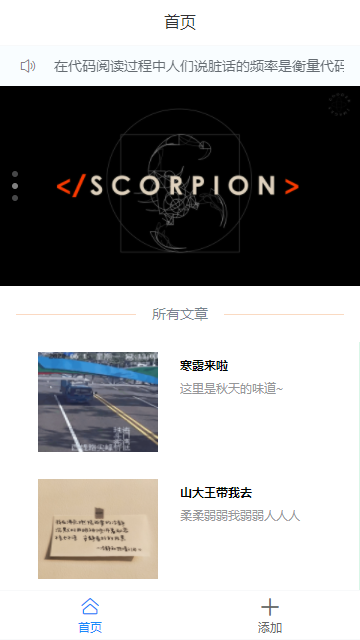
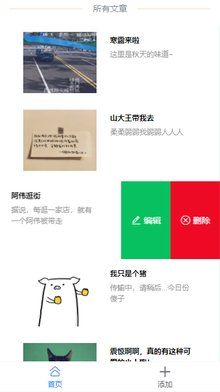
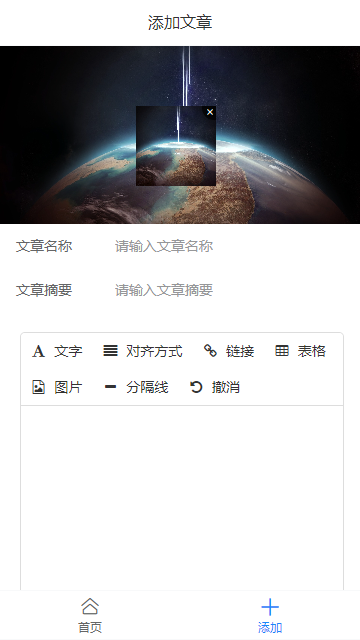

## **山岚笔札 V1.0**

>本项目demo为配合egg.js搭建的服务接口，链接mysql数据库测试CRUD使用，使用Vue开发，具备完整的增删改查功能。

**预览图**



***


***



***




## **前端项目文件结构**
```
dif-client
├─ .gitignore
├─ babel.config.js
├─ package-lock.json
├─ package.json
├─ public
│  ├─ favicon.ico
│  └─ index.html
├─ README.md
├─ src
│  ├─ App.vue
│  ├─ assets
│  │  ├─ bg1.jpg
│  │  ├─ bg2.jpg
│  │  ├─ bg3.jpg
│  │  ├─ logo.png
│  │  └─ twoP.jpg
│  ├─ common
│  │  └─ initHtmlEditor.js
│  ├─ components
│  │  └─ HelloWorld.vue
│  ├─ main.js
│  ├─ router
│  │  └─ index.js
│  └─ views
│     ├─ add.vue
│     ├─ details.vue
│     └─ home.vue
└─ vue.config.js

```

## **使用方法：**

* 克隆本仓库，npm i 安装所有依赖包
* 修改vue.config.js的代理地址为有效的后台服务（可参考仓库 [山岚笔札*后台](超链接地址 "这里有更为具体的配置学习说明文档")）
* 启动项目  npm run serve  就可以愉快的玩耍啦~

```javascript
module.exports = {
  lintOnSave: false,
  devServer: {
    proxy: {
      "/": {
        //   下面这行替换成你的服务地址
        target: "http://localhost:7001/",
        ws: true,
        changeOrigin: true,
      },
    },
  },
  runtimeCompiler: true,
};
```

>ps: 如果你的后台不是使用egg搭建,可以参考本demo的几个请求,自己使用java\Python\go等其他语言创建服务,能调通即可.